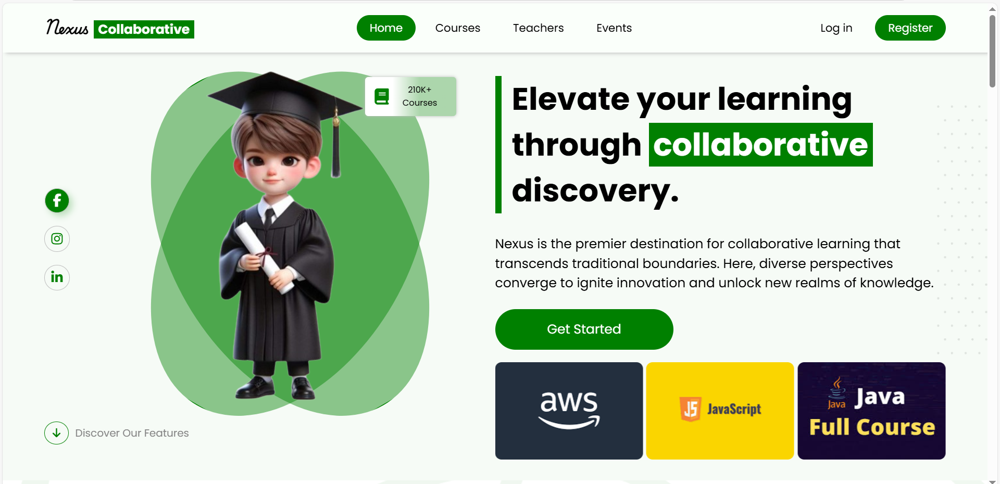
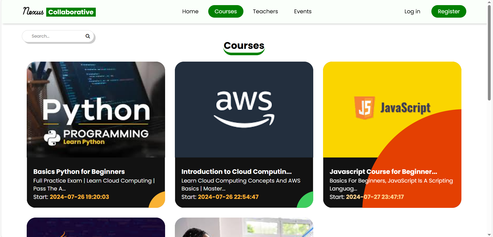
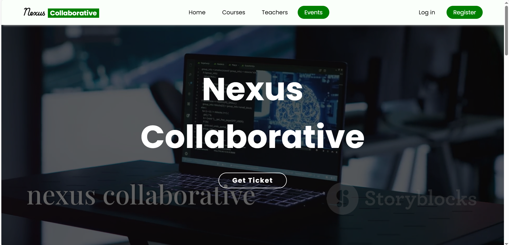
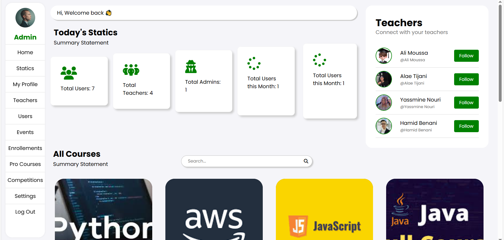
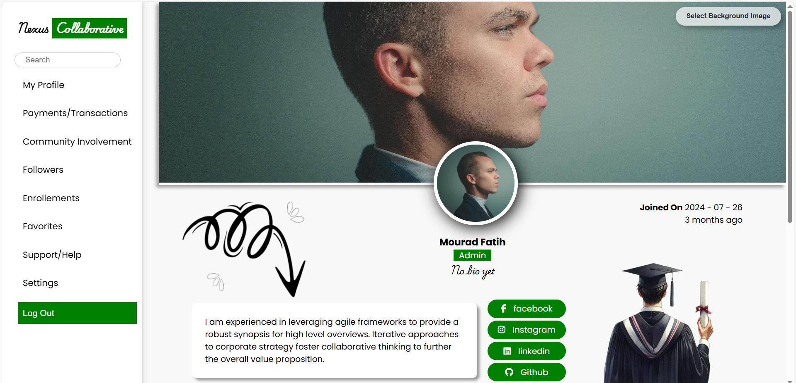
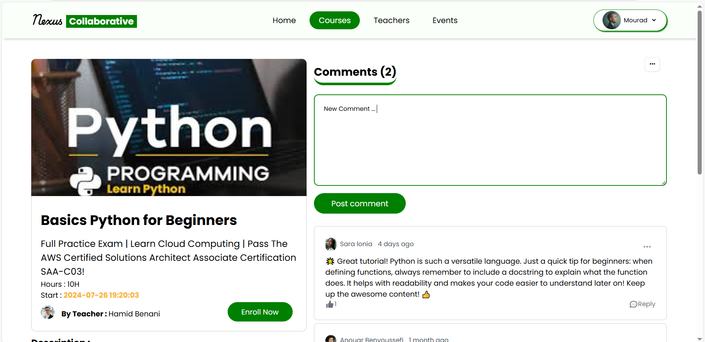
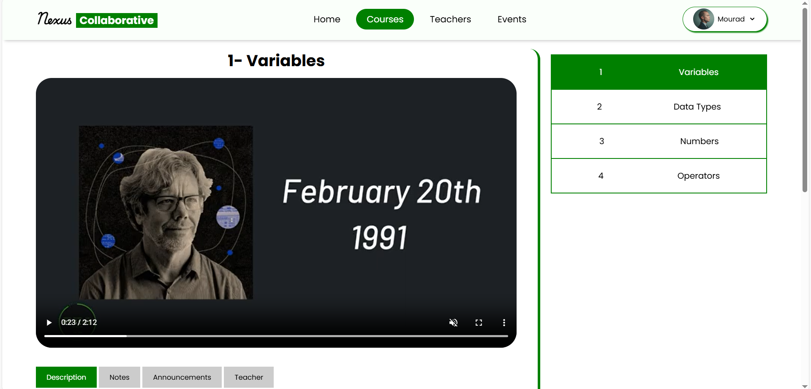
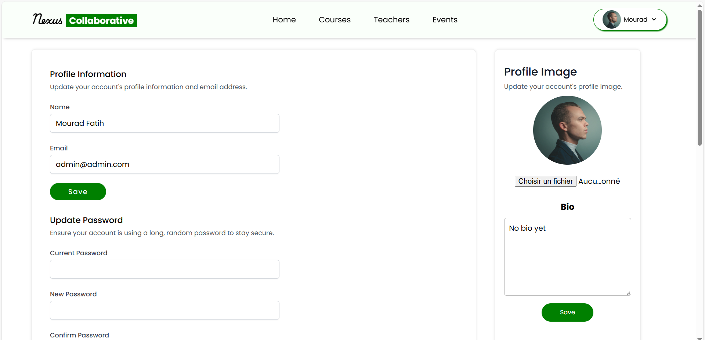

<h1 align="center">Nexus Collaborative</h1>

Nexus Collaborative is an innovative educational platform meticulously crafted to transform the learning experience for students. Built with the powerful Laravel framework, it ensures a seamless and user-friendly interface that makes studying enjoyable and efficient.

At Nexus Collaborative, I’ve designed a vibrant space where students can not only study but also collaborate and engage with their peers. With a wide array of tools at their fingertips, learners can explore resources, fostering a sense of community and shared knowledge.

I am passionate about education and committed to creating an empowering environment for students. My self-designed platform reflects this vision, making learning accessible and interactive. Whether you’re tackling challenging subjects or seeking to enhance your skills, I hope Nexus Collaborative becomes your go-to resource for academic success.

Join us on this exciting journey of discovery and growth. I can’t wait for you to experience all that Nexus Collaborative has to offer!

admin   :
 <a>admin@admin.com</a>

Teacher :
<a>teacher@teacher.com </a>

User    :
<a>user@user.com</a>

Password All Users    :
<a>123456789</a>

## Home Page :

## Courses Page :

## Events Page :

## Login Page :

## Dashboard Page :

## Profile Page :

## Access to Course Page :

## Start Studying With Courses :

## Settings Profile Page :

